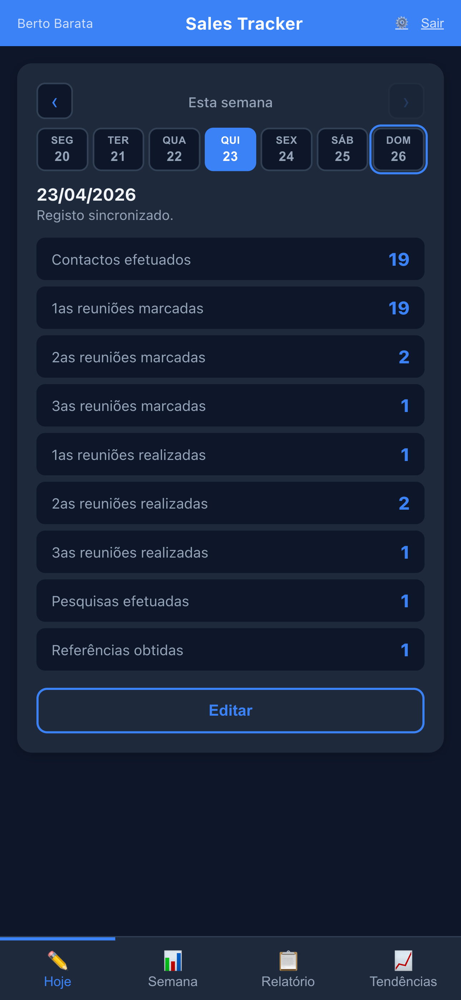
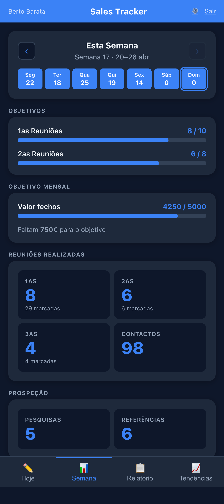
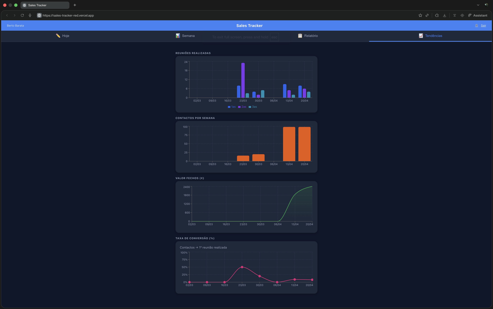
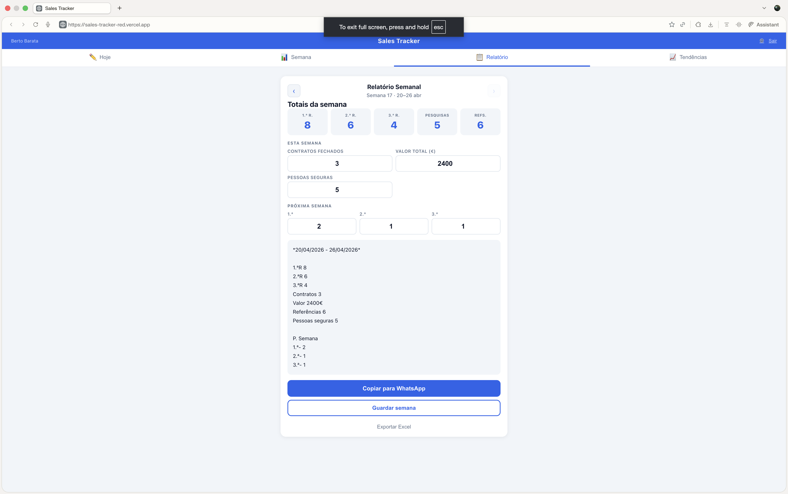
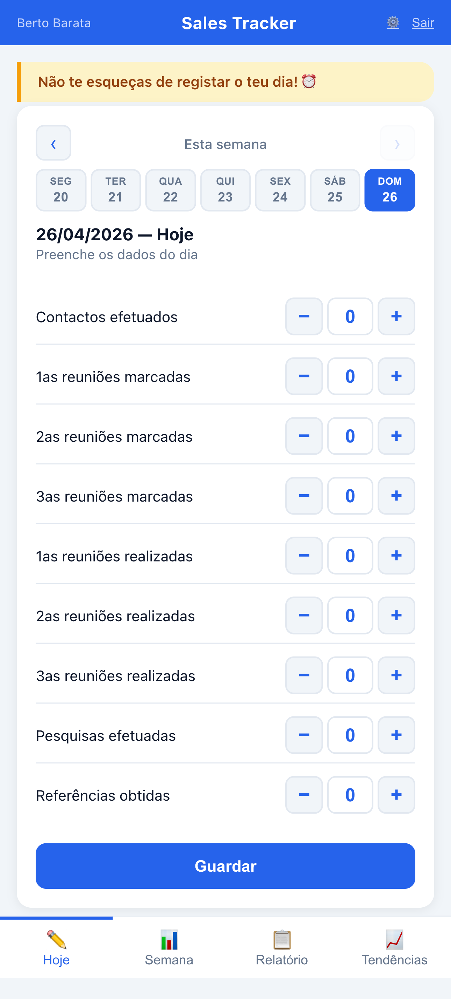

# Sales Tracker

Aplicação web pessoal para registo diário de atividade comercial e geração de relatórios semanais.

Acesso: **[sales-tracker-red.vercel.app](https://sales-tracker-red.vercel.app)**

---

## 📸 Screenshots

<table align="center">
  <tr>
    <td align="center" width="50%">
      <strong>Hoje — input dia-cêntrico</strong><br>
      <br>
      <sub>iPhone 14 Pro · dark</sub>
    </td>
    <td align="center" width="50%">
      <strong>Semana — ISO 8601</strong><br>
      <br>
      <sub>iPhone 14 Pro · dark</sub>
    </td>
  </tr>
</table>

<p align="center">
  <strong>Tendências — histórico semanal (Recharts)</strong><br>
  <br>
  <sub>Desktop · dark</sub>
</p>

<p align="center">
  <strong>Relatório — totais agregados + preview WhatsApp</strong><br>
  <br>
  <sub>Desktop · light</sub>
</p>

<details>
<summary>Light mode em mobile</summary>
<p align="center">
  
</p>
</details>

---

## O que faz

**Registo diário** — introduz os teus dados do dia de forma guiada, campo a campo:

- Contactos efetuados
- 1as, 2as e 3as reuniões marcadas
- 1as, 2as e 3as reuniões realizadas
- Pesquisas efetuadas
- Referências obtidas

**Dashboard semanal** — visão geral da semana com:

- Progresso em relação aos objetivos (10 primeiras reuniões / 8 segundas)
- Totais por categoria
- Dias com registo assinalados

**Relatório semanal** — gera automaticamente o texto para enviar ao team manager via WhatsApp, no formato acordado. Inclui contratos fechados, valor total e reuniões da próxima semana.

**Histórico Excel** — exporta todas as semanas guardadas para um ficheiro `.xlsx` para análise de evolução.

---

## Tecnologias

| Camada        | Tecnologia                                  |
| ------------- | ------------------------------------------- |
| Frontend      | React + Vite                                |
| Estilo        | CSS puro (responsivo, dark mode automático) |
| Autenticação  | Firebase Auth (Google)                      |
| Base de dados | Firebase Firestore (sync em tempo real)     |
| Hosting       | Vercel                                      |
| Excel         | SheetJS (xlsx)                              |

---

## Funcionalidades

- **PWA** — instalável no iPhone via Safari ("Adicionar ao ecrã inicial")
- **Sync em tempo real** — dados sincronizados entre PC e telemóvel via Firestore
- **Dark mode** — adapta-se automaticamente ao sistema
- **Responsivo** — navegação em baixo no mobile, no topo no PC
- **Input adaptado** — numpad próprio no mobile, teclado nativo no PC

---

## Configuração local

### Pré-requisitos

- Node.js 18+
- Conta Firebase com projeto configurado

### Instalação

```bash
git clone https://github.com/bertobarata/sales-tracker.git
cd sales-tracker
npm install
```

### Firebase

Cria um projeto em [console.firebase.google.com](https://console.firebase.google.com) com:

- **Authentication** → Google ativado como método de login
- **Firestore Database** → criado (ver regras abaixo)

Copia o template de variáveis de ambiente e preenche com as credenciais do projeto (obtidas em **Project settings → General → Your apps**):

```bash
cp .env.example .env.local
```

Edita `.env.local`:

```
VITE_FIREBASE_API_KEY=...
VITE_FIREBASE_AUTH_DOMAIN=sales-tracker-xxxxx.firebaseapp.com
VITE_FIREBASE_PROJECT_ID=sales-tracker-xxxxx
VITE_FIREBASE_STORAGE_BUCKET=sales-tracker-xxxxx.firebasestorage.app
VITE_FIREBASE_MESSAGING_SENDER_ID=...
VITE_FIREBASE_APP_ID=...
```

> **Nota:** o `.env.local` está no `.gitignore` e nunca vai para o repositório. A `apiKey` Firebase Web é pública por design — a segurança é garantida pelas Firestore Security Rules (ver abaixo) e por restrições de domínio configuradas no [Google Cloud Console](https://console.cloud.google.com/apis/credentials).

### Regras do Firestore

```
rules_version = '2';
service cloud.firestore {
  match /databases/{database}/documents {
    match /users/{uid}/{document=**} {
      allow read, write: if request.auth != null && request.auth.uid == uid;
    }
  }
}
```

### Correr localmente

```bash
npm run dev
# ou para acesso na rede local (telemóvel):
npm run dev -- --host
```

### Deploy

```bash
vercel --prod
```

---

## Estrutura do projeto

```
src/
├── components/
│   ├── AuthGate.jsx       # Login com Google
│   ├── DailyInput.jsx     # Registo diário guiado
│   ├── Dashboard.jsx      # Visão semanal + objetivos
│   ├── NumPad.jsx         # Teclado numérico para mobile
│   └── WeeklyReport.jsx   # Geração do relatório
├── utils/
│   ├── storage.js         # localStorage
│   ├── sync.js            # Firestore sync
│   └── report.js          # Geração de texto WhatsApp + Excel
├── firebase.js            # Configuração Firebase
└── App.jsx                # Navegação principal
```

---

## Objetivos semanais

Os objetivos estão definidos em `src/components/Dashboard.jsx`:

```js
const GOALS = {
  primeirasReunioesRealizadas: 10,
  segundasReunioesRealizadas: 8,
};
```

## Altera estes valores para ajustar os teus objetivos.

## Licença

[MIT](LICENSE) — Berto Afonso Barata, 2026
